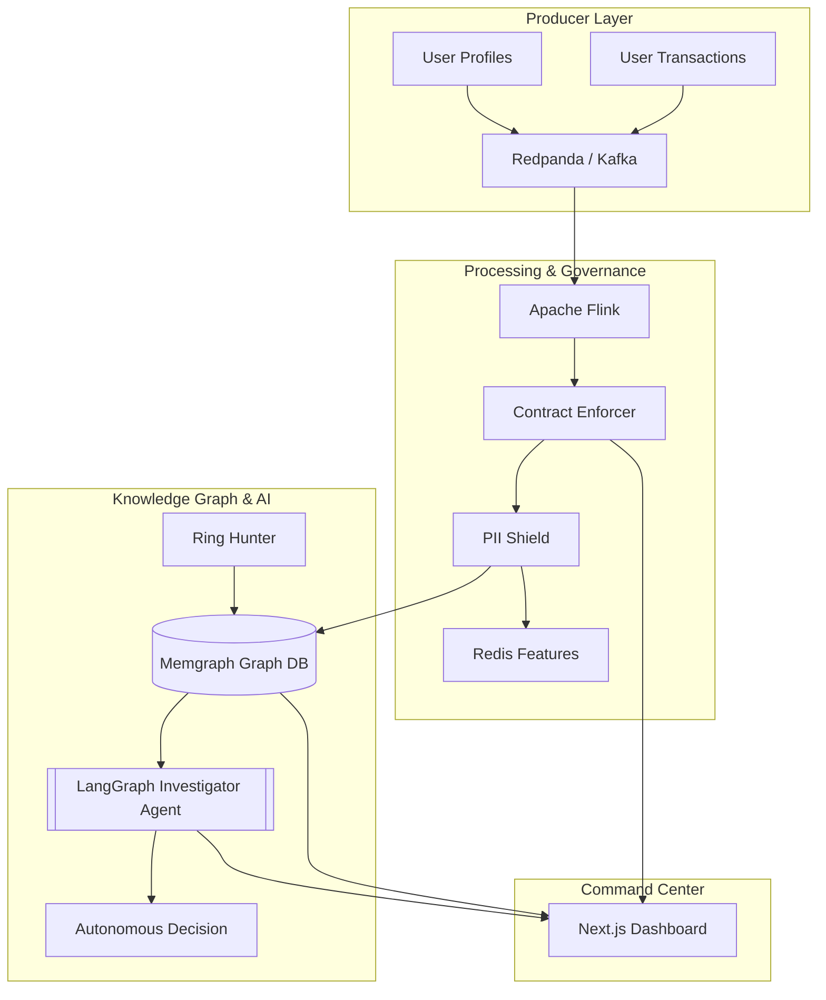

# Temporal Intelligence Engine v1.0.4-sovereign

> **Elite-Tier Real-time Fraud Detection & Data Governance Platform**

The Temporal Intelligence Engine is an autonomous, agentic system designed to identify and investigate fraud rings in real-time while enforcing absolute data sovereignty. Built with **Apache Flink**, **Memgraph**, and **LangGraph**.

---

## ⚡ Key Intelligence Features

### 1. The Autonomous Ring Hunter
A dedicated [Ring Hunter](file:///c:/Users/Ovindu/Documents/GitHub%20Fun%20Projects/TemporalEngine/ring_hunter.py) that periodically scans the graph using **Weakly Connected Components (WCC)** and community detection to identify suspicious user patterns and mark them for investigation.

### 2. Data Sovereignty Guard
A governance layer that enforces [Data Contracts](file:///c:/Users/Ovindu/Documents/GitHub%20Fun%20Projects/TemporalEngine/contract.json) and masks PII using **Microsoft Presidio** before storage.
- **Status**: [PII Masking Verified](file:///c:/Users/Ovindu/Documents/GitHub%20Fun%20Projects/TemporalEngine/test_pii.py)

### 3. Agentic Investigator
Powered by **LangGraph**, the engine features a self-reasoning investigator that performs:
- Graph Context Gathering.
- Network Analysis & Device Fingerprinting.
- Autonomous Risk Decision ([ALLOW, BLOCK, INVESTIGATE]).

---

## 🛠️ Unified Architecture



---

## 🚀 One-Click Launch

1.  **Orchestrate Infrastructure**:
    ```bash
    docker-compose up -d
    ```

2.  **Submit Flink Job**:
    ```bash
    python processor.py
    ```

3.  **Launch Phase 6 Dashboard**:
    ```bash
    cd dashboard && npm run dev
    ```

4.  **Engage the Ring Hunter**:
    ```bash
    python ring_hunter.py
    ```

---

## 🔒 Security & Governance

- **PII Labeling**: `[REDACTED_NAME]`, `[REDACTED_EMAIL]`.
- **Contract Enforcement**: Automated tagging of "Schema Drift" and unauthorized fields.

---

> [!IMPORTANT]
> **Production Synchronization**: 
> This repository is synchronized via [GitHub Actions](file:///c:/Users/Ovindu/Documents/GitHub%20Fun%20Projects/.github/workflows/production-sync.yml) to ensure that only governance-vetted code reaches the production environment.
